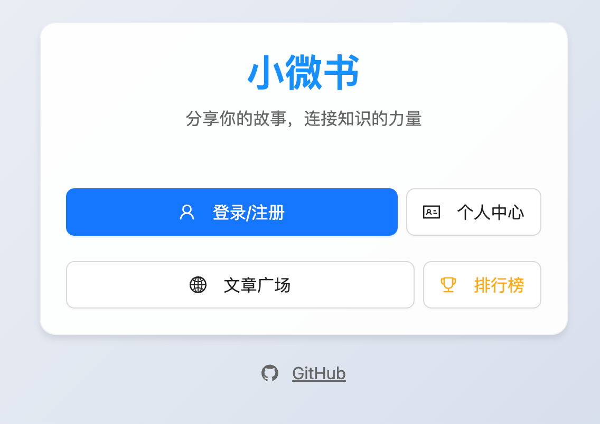
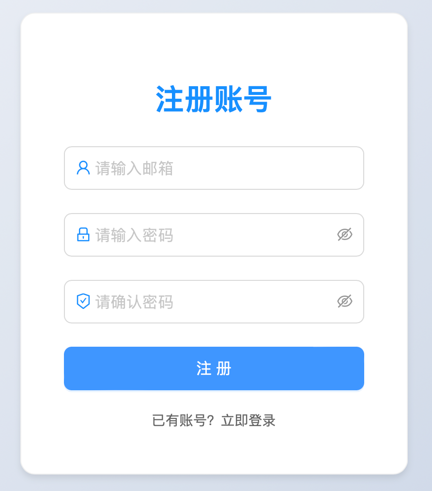
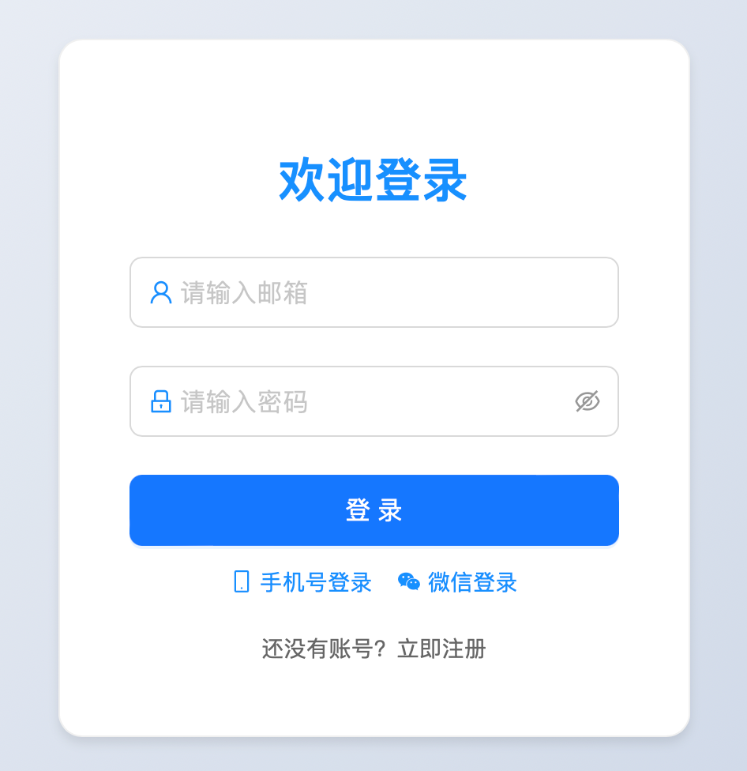
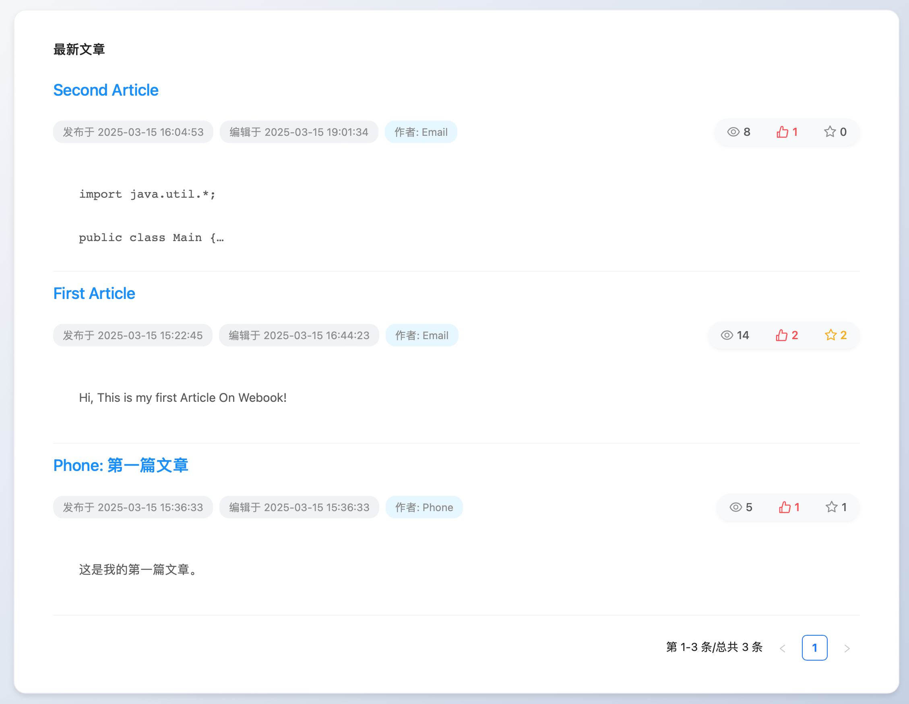
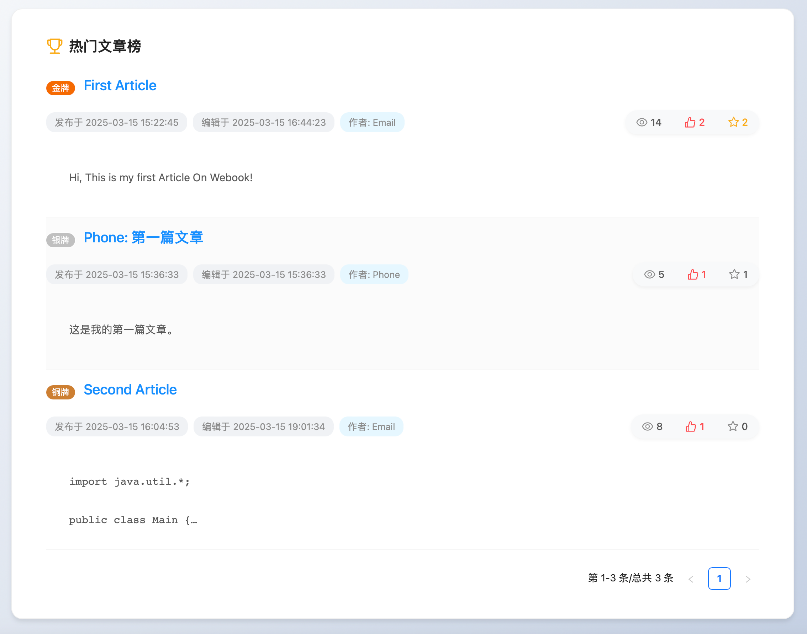
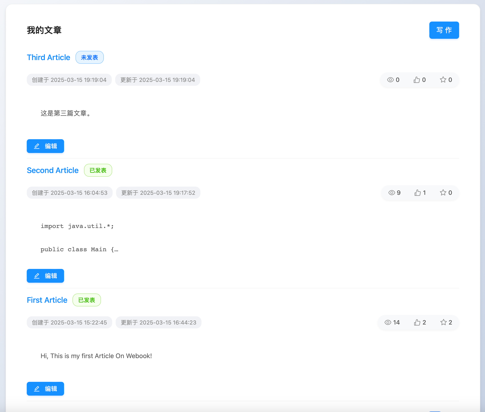
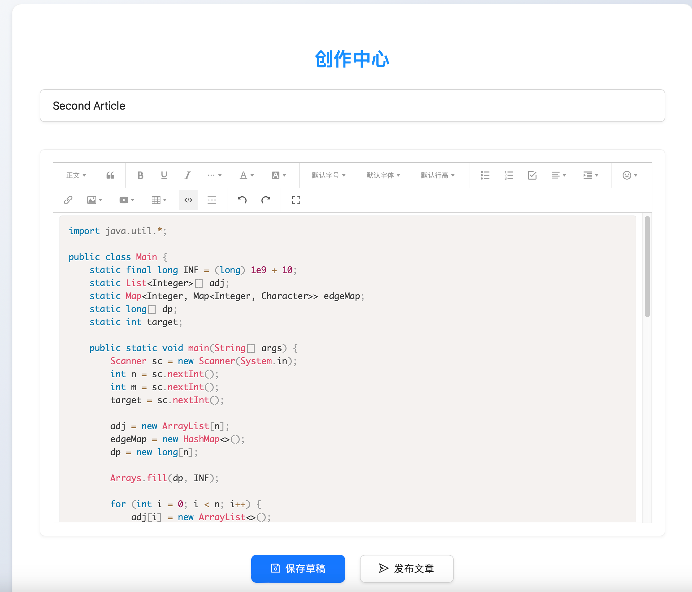

# Webook

## Webook小微书

- DDD 框架：Domin-Drive Design

    

项目架构

```bash
.
├── config
│   ├── dev.go
│   ├── dev.yaml
│   ├── k8s.go
│   ├── redisExpire.go
│   ├── test.yaml
│   └── types.go
├── internal
│   ├── domain
│   ├── integration
│   ├── job
│   ├── repository
│   ├── service
│   └── web
├── ioc
│   ├── db.go
│   ├── job.go
│   ├── log.go
│   ├── redis.go
│   ├── sms.go
│   ├── web.go
│   └── wechat.go
├── main.go
├── pkg
│   ├── ginx
│   ├── limiter
│   └── logger
├── script
│   └── mysql
├── webook
├── Dockerfile
├── docker-compose.yaml
├── app.go
├── Makefile
├── wire.go
└── wire_gen.go
```

项目启动：
- 前端：在 webook-fe 目录下，执行 `npm run dev`
- 后端：在 webook 目录下，执行 `go run . --config config/dev.yaml`
  - 配置文件：config/dev.yaml
  - `go run .` ：在当前目录下运行，包含 wire 生成的代码
- 第三方依赖：在 webook 目录下，执行 `docker compose up`
  - 执行 `docker compose down` 会删除数据库，结束 `docker compose up` 进程不会
  - 包含 mysql ，redis，viper，etcd
- 依赖注入：在 webook 目录下，执行 `wire`
- mock: 在 Webook 目录下，执行 `make mock`


## 页面预览

### 主页




### 登录/注册






### 文章广场



### 热榜



### 我的文章



### 编辑文章



### 个人资料


## 功能介绍

功能详细介绍见 **[博客: webook](https://docs.selfknow.cn/projects/golang/webook/)**