# Webook

Webook小微书（仿小红书）

- DDD 框架：Domin-Drive Design

    

项目启动：
- 前端：在 webook-fe 目录下，执行 `npm run dev`
- 后端：在 webook 目录下，执行 `go run . --config config/dev.yaml`
  - 配置文件：config/dev.yaml
  - `go run .` ：在当前目录下运行，包含 wire 生成的代码
- 第三方依赖：在 webook 目录下，执行 `docker compose up`
  - 执行 `docker compose down` 会删除数据库，结束 `docker compose up` 进程不会
  - 包含 mysql 数据库，redis，viper
- mock: 在 Webook 目录下，执行 `make mock`

## 注册功能

1. Bind 绑定请求参数，绑定到结构体 UserSignUpReq
2. 用正则表达式校验邮箱和密码格式
3. 确认密码和密码一致
4. 调用 service 层进行注册
5. 返回注册成功

> 跨域请求：
>
> 项目是前后端分离的，前端是 Axios，后端是Go，所以需要跨域请求。
>
> - 跨域请求：协议、域名、端口有一个不同，就叫跨域
> - Request Header 和 Response Header 中的字段要对应上
> - 采用 middleware 中间件进行跨域请求
>
> docker compose 安装数据库
>
> - 静默启动；
>
>     ```bash
>      docker compose up -d
>     ```
>
> - `docker compose up` 初始化 docker compose 并启动
>
> - `docker compose down` 删除 docker compose 里面创建的各种容器，数据库
>
> - 只要不 down 数据库一直都在
>
> DDD 框架：Domin-Drive Design
>
> - Domain: 领域，存储对象
> - Repository: 数据存储
> - Service: 业务逻辑

## 登录功能

登录功能分为两件事：
- 实现登录功能
- 登录状态的校验

登录功能：

1. 绑定请求参数，绑定到结构体 UserLoginReq
2. 在 service 层中，根据邮箱查询用户是否存在，密码是否正确
3. 返回登录结果

登录状态的校验：
- 利用 Gin 的 session 插件，从 cookie 中获取 sessionID，校验登录状态
- 采用 Cookie 和 Session 进行登录状态的保持
- 接入 JWT 后，采用 JWT Token 和 Token Refresh 进行登录状态的保持
- 

> Cookie：
> - Domain：Cookie 可以在什么域名下使用
> - Path：Cookie 可以在什么路径下使用
> - Expires/Max-Age：Cookie 的过期时间
> - HttpOnly：Cookie 是否可以通过 JS 访问
> - Secure：Cookie 是否只能通过 HTTPS 访问
> - SameSite：Cookie 是否只能在同一个站点下使用

> Session：
> - 存储在服务器端
> - 通过 SessionID 来识别用户
> - 一般通过 Cookie 来传递 SessionID
>
> Redis：
> - 用户数据存储在 Redis 中
>
> LoginMiddlewareBuilder：
> - 登录中间件，用于校验登录状态
> - 通过 IgnorePaths 方法，设置不校验登录状态的路径
> - 通过 Build 方法，构建中间件: 链式调用
>
> Debug 定位问题：
> 倒排确定：http 发送请求，中间件，业务逻辑，数据库
> F12 查看错误信息
> 后端看日志
>
> Session 的过期时间：
> - 通过中间件 LoginMiddlewareBuilder 设置，当访问不在 IgnorePaths 的路径时，会更新 Session 的 update_time 字段
> - 同时更新 Session 的过期时间 MaxAge
> - 但每次访问都要从 Redis 中获取 Session，性能较差（所以后面引入 JWT）
>
> 接入 JWT：
> - 在 Login 方法中，生成 JWT Token，并返回给前端 x-jwt-token
> - 跨域中间件 设置 x-jwt-token 为 ExposeHeaders
> - Middleware 中，解析 JWT Token，验证 signature
> - 前端要携带 x-jwt-token 请求
> - 实现 JWT Token 的刷新，长短 token 的过期时间不同，多实例部署时，需要考虑 token 的过期时间
>
> 登录安全
> - 限流，采用滑动窗口算法：一分钟内最多 100 次请求- 
> - 检查 userAgent 是否一致

## Kubernets 入门

Pod: 实例
Service: 服务
Deployment: 管理 Pod

准备 Kubernetes 容器镜像：

- 创建可执行文件 `GOOS=linux GOARCH=arm go build -o webook .`
- 创建 Dockerfile，将可执行文件复制到容器中，并设置入口点
- 在命令行中登录 Docker Hub，`docker login`
- 构建容器镜像：`docker build -t techselfknow/webook:v0.0.1 .`

删除工作负载 deployment， 服务 service， 和 pods：

- 删除s Deployment：`kubectl delete deployment webook`
- 删除 Service：`kubectl delete service webook`
- 删除 Pod：`kubectl delete pod webook`

Deployment 配置：

- 创建 k8s-webook-deployment.yaml 文件
- 在命令行中执行 `kubectl apply -f k8s-webook-deployment.yaml`
- 查看 Deployment 状态：`kubectl get deployment`
- 查看 Pod 状态：`kubectl get pod`
- 查看 Service 状态：`kubectl get service`
- 查看 Node 状态：`kubectl get node`

> Deployment 配置：
> - replicas: 副本数,有多少个 pod
> - selector: 选择器
>   - matchLabels: 根据 label 选择哪些 pod 属于这个 deployment
>   - matchExpressions: 根据表达式选择哪些 pod 属于这个 deployment
> - template: 模板，定义 pod 的模板
>   - metadata: 元数据，定义 pod 的元数据
>   - spec: 规格，定义 pod 的规格
>     - containers: 容器，定义 pod 的容器
>       - name: 容器名称
>       - image: 容器镜像
>       - ports: 容器端口
>         - containerPort: 容器端口
>

Service 配置：

- 创建 k8s-webook-service.yaml 文件，采用 LoadBalancer 类型
- 在命令行中执行 `kubectl apply -f k8s-webook-service.yaml`
- 查看 Service 状态：`kubectl get service`

> Service 中的端口(`spec.ports.targetPort`)和 Deployment 中的端口(`spec.containers.ports.containerPort`)对应关系, main.go 中配置的端口(`server.Run(":8080")`) 要保持一致.

k8s 中 mysql 配置：

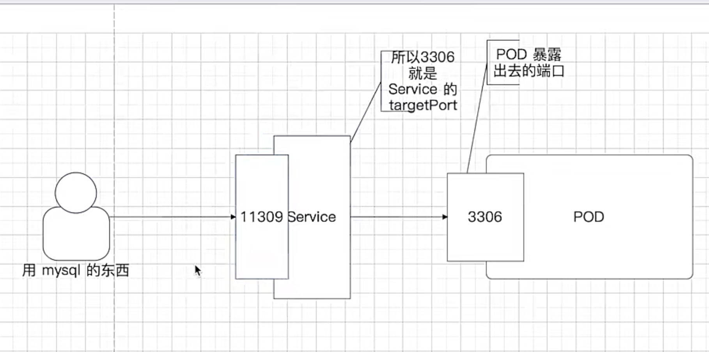

```bash
webook main* ❯ kubectl get services                   
NAME           TYPE           CLUSTER-IP       EXTERNAL-IP   PORT(S)          AGE
kubernetes     ClusterIP      10.96.0.1        <none>        443/TCP          38h
webook-mysql   LoadBalancer   10.101.251.206   localhost     3309:32695/TCP   18s
```

区分服务端口和容器端口：
- 服务端口 port：外部访问的端口
- 容器端口 targetPort：容器内部监听的端口
- ```yaml
  ports:
    - protocol: TCP
      port: 3309
      targetPort: 3306
  ```

k8s 中 mysql 持久化存储配置：

- 创建 k8s-mysql-deployment.yaml 文件
- 创建 k8s-mysql-pv.yaml 文件
- 创建 k8s-mysql-pvc.yaml 文件
- 在命令行中执行 `kubectl apply -f k8s-mysql-pv.yaml`
- 在命令行中执行 `kubectl apply -f k8s-mysql-pvc.yaml`
- 在命令行中执行 `kubectl apply -f k8s-mysql-deployment.yaml`

持久化之后，mysql 数据存储在 `/mnt/data` 目录下，而不是在容器中。
删除 Deployment 后，mysql 数据不会丢失，因为数据存储在 PV 中。
重新创建 Deployment 后，mysql 数据会从 PV 中恢复。

> 持久化存储：
> - PV: 持久化卷，物理存储
> - PVC: 持久化卷声明，逻辑存储
> - 持久化存储的挂载路径：/var/lib/mysql （mysql 数据存储路径）

配置 mysql 的 k8s 环境

```yaml
spec:
  selector:
    app: webook-mysql
  ports:
    - protocol: TCP
      # 服务端口, 外部访问的端口
      port: 11309
      # 容器端口, 容器内部监听的端口
      targetPort: 3306
      # type 为 NodePort 时, 需要指定 nodePort
      # 指定 nodePort 后, 可以通过 nodeIP:nodePort 访问服务
      nodePort: 30002
  type: NodePort
```


port (Service 端口):

- 这是 Service 暴露给 Kubernetes 集群内部其他 Pod 或 Service 的端口。
- 当集群内部的 Pod 需要访问这个 Service 时，它们会使用这个端口。
- 在上面的 YAML 示例中，port: 11309 表示 Service 会在 11309 端口上监听连接请求。
- 客户端（在集群内部）访问 Service 时，会使用这个端口进行连接。
- 注意： 这个端口仅在 Kubernetes 集群内部使用。

targetPort (Pod 端口):

- 这是 Service 将请求转发到的目标 Pod 的端口。
- targetPort 通常与 Pod 中运行的容器监听的端口一致。
- 在上面的 YAML 示例中，targetPort: 3306 表示 Service 会将连接请求转发到目标 Pod 的 3306 端口，即你的 MySQL 容器内部监听的端口。
- 通常，你的 MySQL 服务（或者其他应用程序）在容器内部会监听这个端口。
- 注意： 在 Kubernetes 中，Pod 内部的端口号是相对于 Pod 内部的网络命名空间而言的。

nodePort (Node 端口):

- 这是当你的 Service type 设置为 NodePort 时，Kubernetes 集群中每个节点的 IP 地址上都会暴露的端口。
- 当你需要从 Kubernetes 集群外部访问你的 Service 时，可以使用节点的 IP 地址和这个 nodePort 进行访问。
- 在上面的 YAML 示例中，nodePort: 30002 表示 Kubernetes 会在所有节点的 IP 地址上开启 30002 端口，并将发送到这个端口的流量转发到 Service。
- 客户端（在集群外部）可以通过节点的 IP 地址和 nodePort 连接到服务。
- 注意： NodePort 的端口号通常在 30000-32767 之间，并且必须是唯一的。
- 在上面的 YAML 示例中，nodePort: 30002 表示 Kubernetes 会在所有节点的 IP 地址上开启 30002 端口，并将发送到这个端口的流量转发到 Service。
- 客户端（在集群外部）可以通过节点的 IP 地址和 nodePort 连接到服务。
- 注意： NodePort 的端口号通常在 30000-32767 之间，并且必须是唯一的。
- 注意： 使用 NodePort 时，你仍然需要访问 Kubernetes 集群节点来访问服务。它并不直接将端口暴露到互联网上。

## WRK 压测

- 安装 wrk：`brew install wrk`
- 压测：`wrk -t4 -c100 -d10s -s ./scripts/signup.lua http://localhost:8080/users/signup`
  - -t4：4 个线程
  - -c100：100 个连接
  - -d10s：10 秒
  - -s ./scripts/signup.lua：lua 脚本
  - http://localhost:8080/users/signup：请求路径

> 如何在测试中维护登录状态：
> - 在初始化中模拟登录，拿到对应的登录态的 cookie
> - 手动登录，复制对应的 cookie，在测试中使用

### Redis 缓存优化

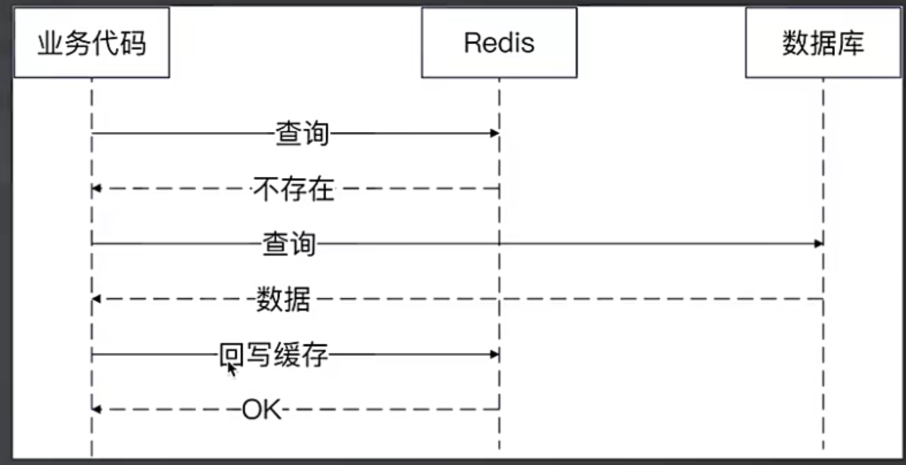

查询用户时，先从 Redis 缓存中查询，如果缓存中没有，则从数据库中查询，并将查询结果缓存到 Redis 中。
- 缓存中的 user 是 domain.User，数据库中的 user 是 dao.User，从数据库查询到 user 后，需要将 dao.User 转换为 domain.User
- 数据库限流：数据库限流，防止缓存击穿后，数据库压力过大
- 缓存失败：属于偶发事件，从数据库中查询到用户，但缓存失败，此时我们打日志，做监控，不返回错误。

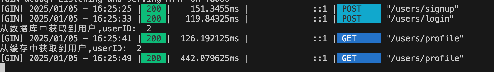

## 短信验证码登录

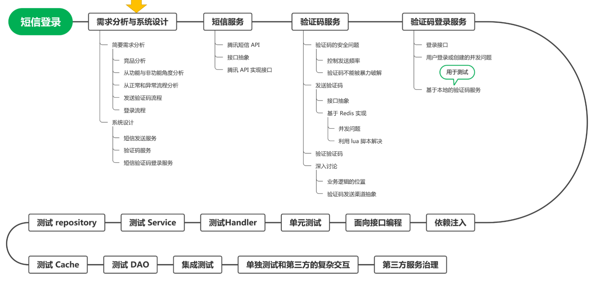

### 需求分析

参考竞品：参考别人的实现

从不同角度分析：
- 功能角度：具体做到哪些功能，不同功能的优先级
- 非功能角度：
  
  1. 安全性：保证系统不会被人恶意搞崩
  2. 扩展性：应对未来的需求变化，这很关键
  3. 性能：优化用户体验

- 从正常和异常流程两个角度思考

### 系统设计

手机验证码登录有两件事：验证码，登录
- 两个是强耦合吗？
- 其他业务会用到吗？

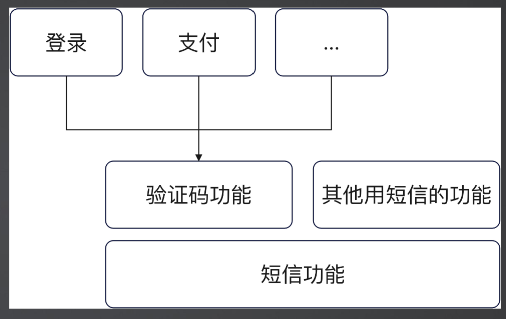

模块划分：
- 一个独立的短信发送服务
- 在独立的短信发送服务的基础上，封装一个验证码功能
- 在验证码功能的基础上，封装一个登录功能

设计原则：
- 类 A 需要使用类 B 的功能，那么 A 应该依赖于一个接口（例如 BInterface），而不是直接依赖于类 B 本身。
- 如果 A 需要使用 B，那么 B 应该作为 A 的字段（成员变量）存在，而不是作为包变量或包方法。
- A 用到了 B，A 绝对不初始化 B，而是外面注入 => 保持依赖注入(DI) 和 依赖反转(IoC)

cache/dao 中的 err 定义（ `var ErrCodeNotFound = errors.New("code not found")`），在 repository 中使用时，要再次定义 （`var ErrCodeNotFound = cache.ErrCodeNotFound`），在 Service 中用 `repo.ErrCodeNotFound` 来使用。
- 解耦层级依赖，每个层级都知道自己可能抛出的错误，并处理这些错误
- 通过将错误变量定义在相关层级中，可以更清晰地了解每个层级的行为和可能发生的错误。


发验证码的并发问题，引入 lua 脚本，解决并发问题
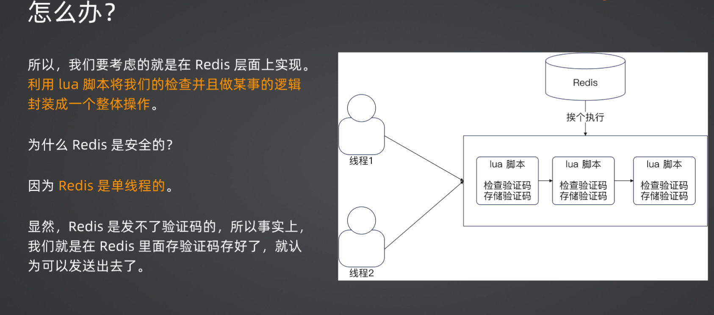

引入手机号登录后，需要修改 dao 层，添加 phone 字段
- 在邮箱登录时，phone 字段为空
- 在手机号登录时，email 字段为空
- 但是 email 和 phone 字段都是唯一索引

解决方法，采用 `sql.NullString` 类型，允许空值
- 在邮箱登录时，phone 字段为空
- 在手机号登录时，email 字段为空
- 但是 email 和 phone 字段都是唯一索引

### sms 登录校验

1. 通过手机号查询用户是否存在
2. 用户不存在，创建用户
  - 创建一个用户
  - 根据手机号查询刚创建的用户
  - 存在主从延迟的问题，可能查询不到
3. 用户存在，直接返回
4. 返回用户信息

## 面向接口编程

面向接口编程，是为了 **扩展性**，而不是为了提高性能或者可靠性。

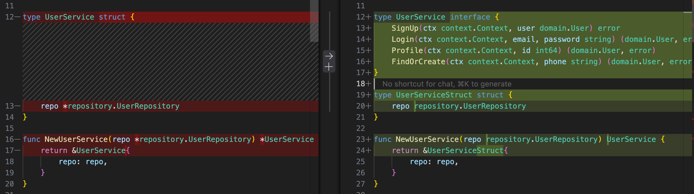

从结构体到接口：

- 左侧的代码使用 struct 定义 UserService，这意味着它是一个具体类型。任何使用 UserService 的地方都直接依赖于这个具体的实现。
- 右侧的代码定义了一个 UserService 接口，它定义了 SignUp、Login、Profile 和 FindOrCreate 这几个方法，而 UserServiceStruct 则是一个实现了这个接口的具体结构体。

构造函数的变化：

- 左侧构造函数返回 *UserService，即 UserService 结构体的指针。
- 右侧构造函数返回 UserService 接口，而不是具体的结构体。

## Profile 接口

Web 层：
- 获取 JWT 中的用户信息
- 调用 Service 层获取用户信息
- 返回用户信息

Service 层：
- 调用 Repository 层的 FindById 方法获取用户信息
- 返回用户信息

Repository 层：
- 从缓存中获取用户信息
- 缓存中没有，从数据库中获取
- 将 dao.User 转换为 domain.User ：添加个人信息字段
  - 将 domain.User 转换为 cache.User ：添加个人信息字段
- 将 domain.User 缓存到 Redis 中
- 返回用户信息

Edit 接口与 Profile 接口的类似，但 Edit 接口在 repo 层需要更新缓存（先删除，再创建）。

## 单元测试

单元测试：针对每一个方法进行的测试，单独验证每一个方法的正确性。
- 理论上来说，你不能依赖任何第三方组件，包括数据库、缓存、外部服务等 

集成测试：多个组件合并在一起的测试，验证各个方法、组件之间的配合无误。

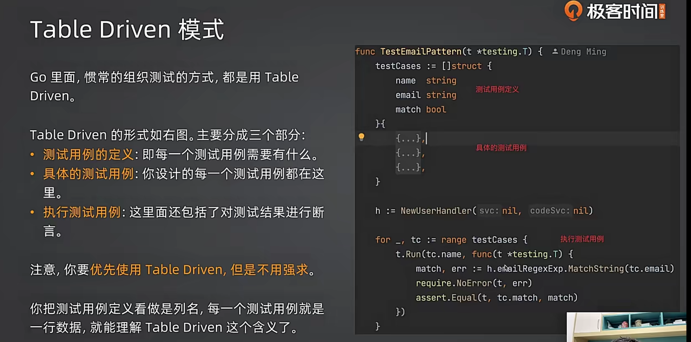

测试用例定义：

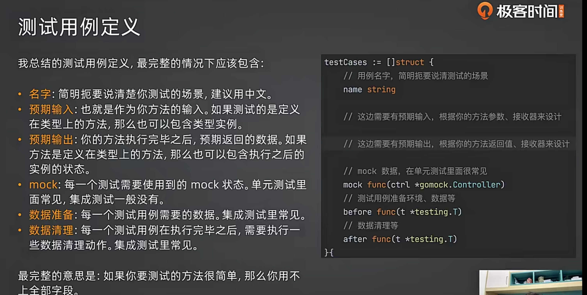

使用 mock 

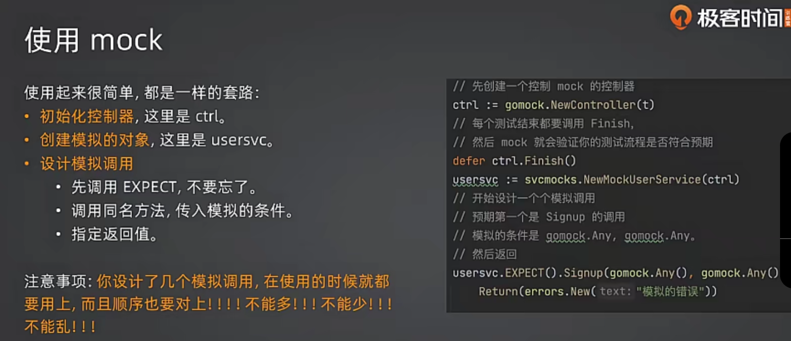

1. 安装 mockgen 工具：`go install github.com/golang/mock/mockgen@latest`
2. 为 UserHandler 依赖的 UserService 生成 mock 实现：`mockgen -source=./webook/internal/service/user.go -destination=./webook/internal/service/mocks/user.go -package=svcmocks`
3. 测试用例匿名结构体定义。
4. 执行测试用例的整体代码
5. 设计具体测试用例并运行：
   - 最开始考虑正常流程
   - 在正常流程的基础上考虑异常流程。

测试用例定义示例：
```go
testCases := []struct {
  name     string
  mock     func(ctrl *gomock.Controller) service.UserService
  reqBody  string
  wantCode int
  wantBody string
}{
  // 注册成功
  {
    name: "注册成功",
    // 模拟依赖：返回一个 mock 的 UserService
    mock: func(ctrl *gomock.Controller) service.UserService {
      userSvc := svcmocks.NewMockUserService(ctrl)
      // 期待调用 SignUp 方法，传入任意 context 和匹配的 domain.User 对象，返回 nil
      userSvc.EXPECT().SignUp(gomock.Any(), domain.User{
        Email:    "123@qq.com",
        Password: "1234#qwe",
      }).Return(nil)
      return userSvc
    },
    // 请求参数
    reqBody: `{"email":"123@qq.com","password":"1234#qwe","confirmPassword":"1234#qwe"}`,
    // 期望响应
    wantCode: http.StatusOK,
    wantBody: "注册成功",
  },
}
```

执行测试用例：
```go
for _, tc := range testCases {
  t.Run(tc.name, func(t *testing.T) {
    ctrl := gomock.NewController(t)
    defer ctrl.Finish()

    // 创建 userHandler 及所需的依赖 userService
    server := gin.Default()
    userSvc := tc.mock(ctrl)
    userHandler := NewUserHandler(userSvc, nil)
    userHandler.RegisterRoutes(server.Group("/users"))

    // 创建请求
    req, err := http.NewRequest(http.MethodPost, "/users/signup", bytes.NewBuffer([]byte(tc.reqBody)))
    req.Header.Set("Content-Type", "application/json")
    assert.Nil(t, err)

    // 执行请求
    resp := httptest.NewRecorder()
    server.ServeHTTP(resp, req)

    // 检查响应
    assert.Equal(t, tc.wantCode, resp.Code)
    assert.Equal(t, tc.wantBody, resp.Body.String())
  })
}
```

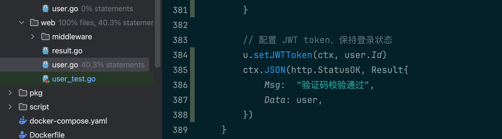

## 高可用的短信服务

抽象接口：定义了统一的短信服务接口

### 客户端限流

```go
//go:embed slide_window.lua
var luaSlideWindow string

// RedisSlideWindowLimiter 基于 Redis 的滑动窗口限流器
type RedisSlideWindowLimiter struct {
	cmd redis.Cmdable
	// 窗口大小
	interval time.Duration
	// 阈值
	rate int
}

func (r *RedisSlideWindowLimiter) Limit(ctx context.Context, key string) (bool, error) {
	return r.cmd.Eval(ctx, luaSlideWindow, []string{key},
		r.interval.Milliseconds(), r.rate, time.Now().UnixMilli()).Bool()
}
```

采用装饰器模式，对短信服务进行限流。

- 装饰器模式：不改变原有实现而增加新特性的一种设计模式

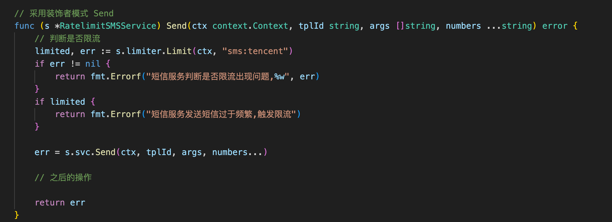

### failover 策略

自动切换短信服务商

- 轮询：出现错误，就换一个服务商进行重试
- 基于超时相应的判定：连续超过 N 个请求超时，切换服务商。

### 提高安全性

增加了 JWT Token 的验证。

```go
type AuthSMSService struct {
	svc sms.Service
	key []byte
}

type AuthSMSClaims struct {
	jwt.RegisteredClaims
	Tpl string
}

func (s *AuthSMSService) Send(ctx context.Context, tplToken string, args []string, numbers ...string) error {
	var claims AuthSMSClaims
	_, err := jwt.ParseWithClaims(tplToken, &claims, func(t *jwt.Token) (interface{}, error) {
		return s.key, nil
	})
	if err != nil {
		return err
	}

	return s.svc.Send(ctx, claims.Tpl, args, numbers...)
}
```

## 微信扫码登录

微信扫码登录是轻轻屁微信 OAuth2.0 授权登录。

请求 Code（临时授权码）
- 发起授权: 用户点击“微信登录”按钮，应用程序将用户重定向至微信的授权页面。
- 构造授权链接: 重定向 URL 包含微信授权页面的地址，以及应用程序的 appid、redirect_uri（回调地址）和 state（状态参数）。 redirect_uri 必须进行 URL 编码。 state 用于防止 CSRF 攻击，应生成随机唯一的值。
- 用户授权: 用户在微信授权页面完成扫码登录并授权。
- 微信回调: 微信将用户重定向回 redirect_uri，并在 URL 参数中包含 code（临时授权码）和 state。
- 后端处理: 后端服务器接收到回调请求 callback，验证 state 参数，然后提取 code。 后端使用此 code 向微信服务器请求 Access Token，OpenID 和 UnionID, 然后通过 OpenID 和 UnionID 查询用户信息。

## 长短 token 设计

短 token：access_token, 用于访问资源，有效期短。

长 token：refresh_token, 用于刷新 access_token，有效期长。

### 用户登录

1. 在 setJWTToken 后，生成 refresh_token
2. 让前端保存 refresh_token
    - 在 CORSConfig 的 ExposeHeaders 中添加 `x-refresh-token`
3. 前端每次请求时候，都携带 token
    - 请求资源时，在 Authorization 中携带 access_token
    - 调用 RefreshToken 的时候，在 Authorization 中携带 refresh_token，用来生成新的 access_token
4. 如果 access_token 过期，则调用 RefreshToken 生成新的 access_token, 前端再用新的 access_token 请求资源

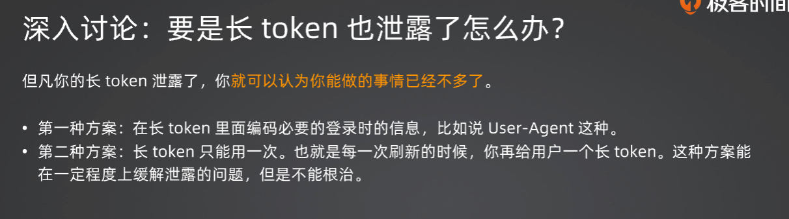

### 用户退出

JWT token 本身是无状态的，在这里在 Redis 用 Ssid 来记录 token 的状态。  

1. 用户登录的时候，生成一个标识 ssid，并置为有效，放到长短 token 中
    - 在 `jwt.go` 中，生成 token 时，加入 ssid 字段。
2. 用户登录校验的时候，检查 ssid 是否有效
    - 用户更新长 token 的时候，也要检查 ssid 是否有效
3. 用户在退出登录的时候，把 ssid 置为无效


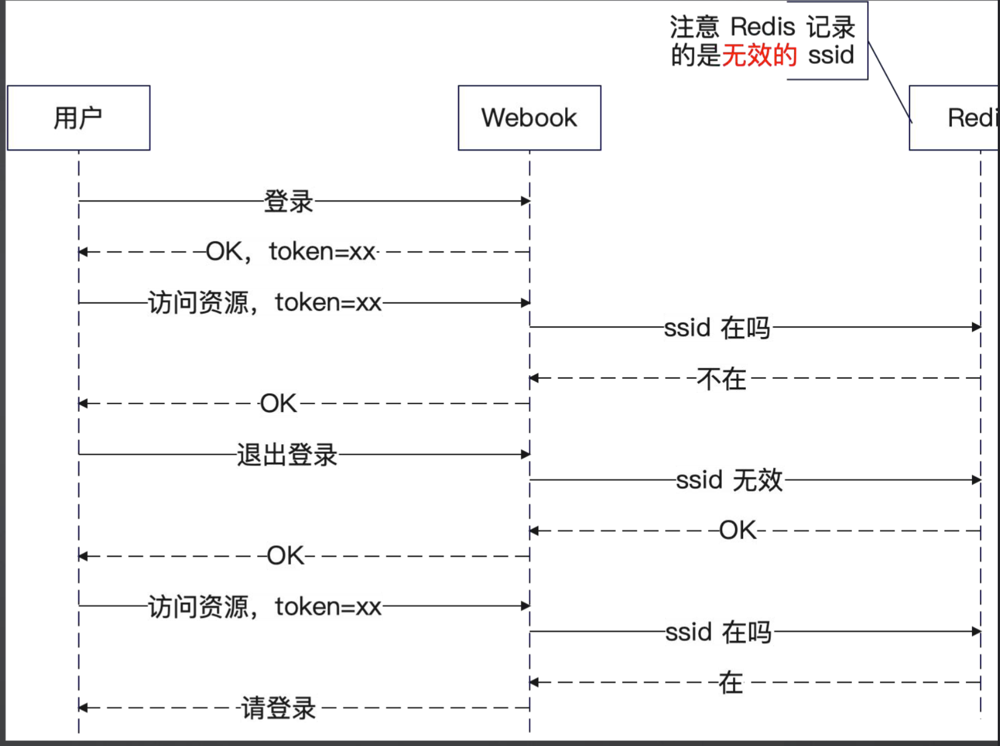

## 配置

配置来源：启动参数，环境变量，配置文件，远程配置中心

- 启动参数：某一次运行的参数，可以考虑在这里提供。最为典型的就是命令行工具，会要求你传入各 种参数，例如在 mockgen 中传递的 source、destination。

- 环境变量：和具体的实例有关的参数都放在这里。比如说在实例的权重，或者实例的分组信息。

- 配置文件：一些当下环境中所需要的通用的配置，比如说我们的数据库连接信息等。

- 远程配置中心：它和配置文件可以说是互相补充的，除了启动程序所需的最少配置，剩下的配置都可 以放在远程配置中心。

### viper

viper 是一个配置管理工具。

- **viper.SetConfigName() 和 viper.SetConfigType():** 指定配置文件名和类型。
- **viper.AddConfigPath():** 添加配置文件的查找路径，Viper 会按照添加的顺序查找。
- **viper.AutomaticEnv():** 自动读取环境变量。
- **viper.SetEnvPrefix():** 设置环境变量的前缀，避免与其他环境变量冲突。
- **viper.BindEnv():** 将配置项和环境变量绑定，方便使用环境变量覆盖配置文件中的值。
- **viper.SetDefault():** 设置默认值，防止程序因缺少配置而崩溃。
- **viper.WatchConfig() 和 viper.OnConfigChange():** 监听配置文件变化，实现动态配置更新。
- **viper.Get...() 方法:** 用于获取配置值，注意类型转换。

读取配置文件：

```go
func InitViper() {
	viper.SetConfigName("dev")
	viper.SetConfigType("yaml")
	viper.AddConfigPath("./config")
	err := viper.ReadInConfig()
	if err != nil {
		panic(err)
	}
}
```


为了让 viper 在不同环境下加载不同的配置文件

- 在启动的时候，传入一个启动参数：`--config=config/dev.yaml`
- 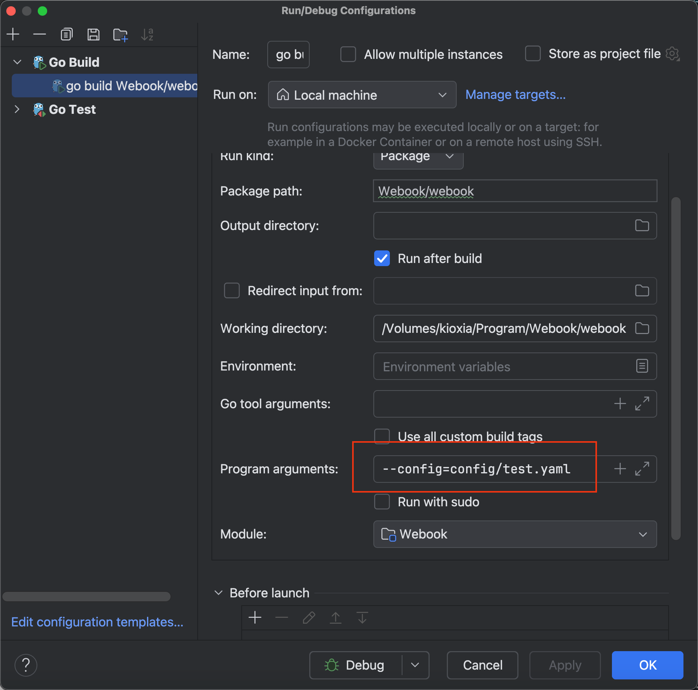

### etcd

配置文件的缺点是不够灵活，难以实现权限控制，实时更新，所以考虑使用远程配置中心：etcd

在 etcd 中添加配置：

- 从文件中写入：`etcdctl --endpoints=127.0.0.1:12379 put /webook "$(<dev.yaml)"`
- 读取配置：`etcdctl --endpoints=127.0.0.1:12379 get /webook`

viper 同时支持监听配置变更

```go
viper.WatchConfig()
viper.OnConfigChange(func(e fsnotify.Event) {
		println("Config file changed:", e.Name)
})
```


扩展：

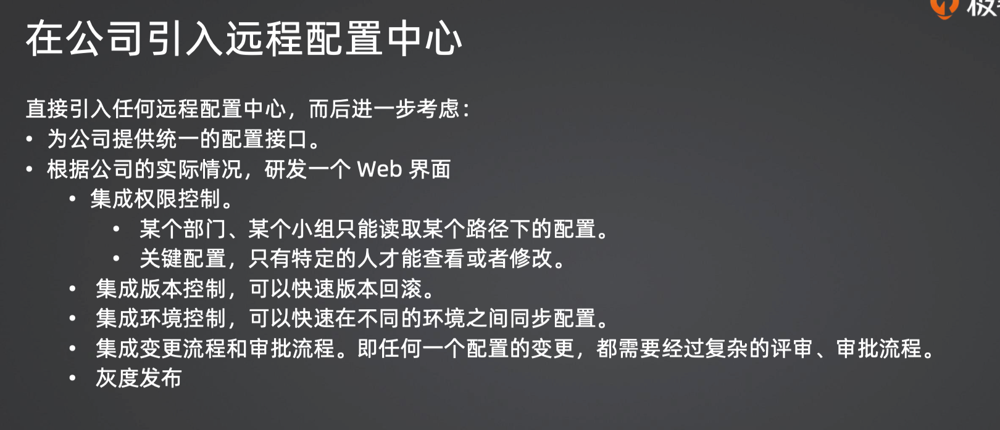


## 发帖功能（TDD）

### 需求分析

创作者：

- 撰写文章
- 修改文章
- 发表文章
- 删除文章
- 文章列表

读者：

- 文章列表
- 阅读文章

状态图：

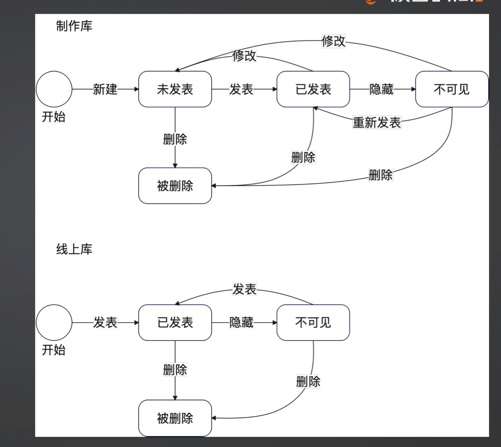

### 发表文章 TDD 开发

TDD：测试驱动开发。

- 先写测试、 再写实现。

通过撰写测试，理清楚接口该如何定义，体会用户 使用起来是否合适。

通过撰写测试用例，理清楚整个功能要考虑的主流 程、异常流程。


这里我写一下在 Service 层中的思考过程，用 Table-Driven Test 的方式来组织测试用例

- 一个 Service 控制两个 repo：读者库和写者库

- ```go
    type ArticleAuthorRepository interface {
    	Create(ctx context.Context, article domain.Article) (int64, error)
    	Update(ctx context.Context, article domain.Article) (int64, error)
    }
    ```

- ```go
    type ArticleReaderRepository interface {
    	// Save 读者只有保存写者创建或修改的文章，即只能被动更新
    	Save(ctx context.Context, article domain.Article) (int64, error)
    }
    ```

测试模版：包含测试参数和如何运行

```go
func TestArticleService_Publish(t *testing.T) {
	testCases := []struct {
		name string
		mock func(ctrl *gomock.Controller) (article.ArticleAuthorRepository, article.ArticleReaderRepository)

		// service 的参数
		article domain.Article

		// service 的期待返回值
		wantId  int64
		wantErr error
	}{
		{},
	}

	for _, tc := range testCases {
		t.Run(tc.name, func(t *testing.T) {
			ctrl := gomock.NewController(t)
			defer ctrl.Finish()

			authorRepo, readerRepo := tc.mock(ctrl)
			svc := NewArticleServiceWithTwoRepo(authorRepo, readerRepo)
			resId, err := svc.PublishWithTwoRepo(context.Background(), tc.article)

			assert.Equal(t, tc.wantErr, err)
			assert.Equal(t, tc.wantId, resId)

		})
	}
}

```

在 Service 中的实现，先调用写者库写入文章，然后再调用读者库返回 id 和 err。

```go
func (a *articleService) PublishWithTwoRepo(ctx context.Context, article domain.Article) (int64, error) {
	// 写者库发表文章
	var id = article.Id
	var err error
	if article.Id > 0 {
		id, err = a.authorRepo.Update(ctx, article)
	} else {
		id, err = a.authorRepo.Create(ctx, article)
	}
	if err != nil {
		return 0, err
	}
	// 确保写者库和读者库的 id 一致
	article.Id = id
	return a.readerRepo.Save(ctx, article)
}
```

所以在测试用例中，要分别模拟两个 Create 的 Expect。

- `authorRepo.EXPECT().Create(gomock.Any(), ...)`: 期望 authorRepo 的 Create 方法被调用，并使用 gomock.Any() 作为 context.Context 的参数。 只有匹配了 Article 对象的内容，确保只有在传入的文章与期望完全一致时，Mock 才会匹配成功。
- readerRepo.EXPECT().Create(gomock.Any(), ...): 类似地，配置了 readerRepo 的 Save 方法。 注意到 readerRepo 期望接收的 Article 对象的 Id 是 1，这是从 authorRepo 返回的 ID。

```go
{
    name: "创建文章，并发布成功",
    mock: func(ctrl *gomock.Controller) (article.ArticleAuthorRepository, article.ArticleReaderRepository) {
        authorRepo := repomocks.NewMockArticleAuthorRepository(ctrl)
        readerRepo := repomocks.NewMockArticleReaderRepository(ctrl)

        // 模拟写者库创建文章的过程，要求入参为 Id 为 0 的 Article
        // 返回 1，nil
        authorRepo.EXPECT().Create(gomock.Any(), domain.Article{
            Id:      0, // 默认是 0，不写这行也行
            Title:   "create article and publish",
            Content: "this is content",
            Author: domain.Author{
                Id: 666,
            },
        }).Return(int64(1), nil)

        // 模拟读者库创建文章的过程，要求入参为 Id 为 1 的 Article
        // 返回 1，nil
        readerRepo.EXPECT().Save(gomock.Any(), domain.Article{
            Id:      1, // 用写者库的 id
            Title:   "create article and publish",
            Content: "this is content",
            Author: domain.Author{
                Id: 666,
            },
        }).Return(int64(1), nil)

        return authorRepo, readerRepo
    },
    article: domain.Article{
        Title:   "create article and publish",
        Content: "this is content",
        Author: domain.Author{
            Id: 666,
        },
    },
    wantId:  1,
    wantErr: nil,
},
```

考虑部分失败的问题：写者库写入成功，但是读者库保存失败了。

- 解决方案：增加重试机制。

```go
// 读者库保存文章，如果失败，则重试, 重试至多 3 次
for i := 0; i < 3; i++ {
    time.Sleep(time.Second * time.Duration(i))
    id, err = a.readerRepo.Save(ctx, article)
    if err == nil {
        break
    }
    a.logger.Error("save article to reader repo failed, try again",
        logger.Int64("article id: ", article.Id),
        logger.Error(err),
    )
}

if err != nil {
    // 重试 3 次仍然失败，则返回错误
    a.logger.Error("reader repo save article failed",
        logger.Int64("article id: ", article.Id),
        logger.Error(err),
    )
}

```

